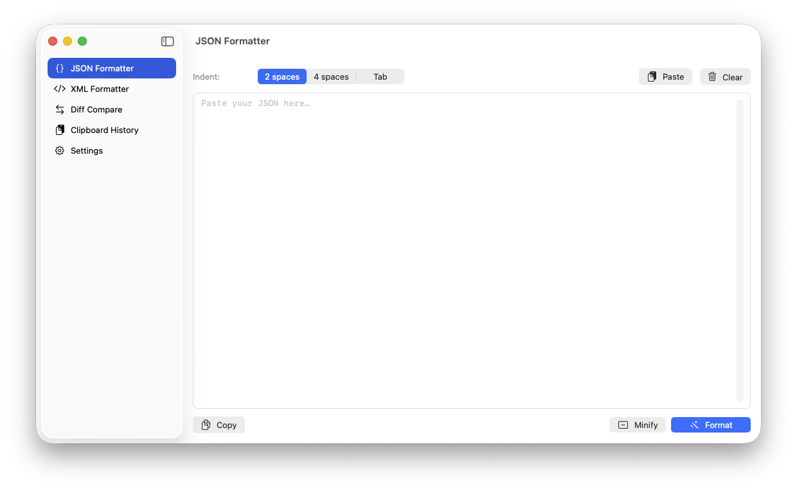
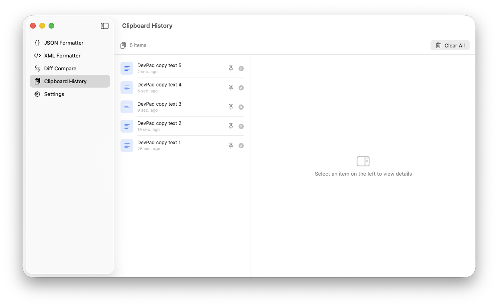
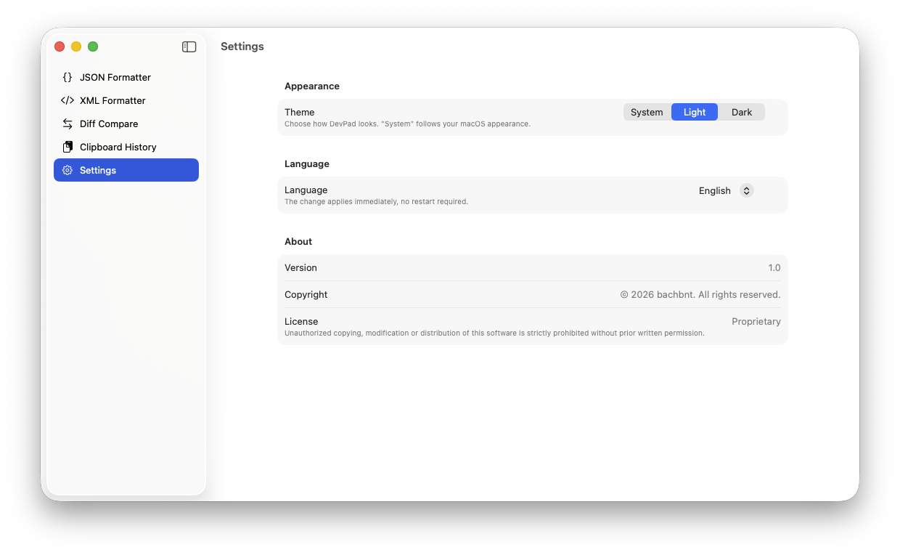

# DevPad

A native macOS developer utility — format JSON/XML, compare diffs, and track clipboard history. Runs quietly in the menu bar and hides the dock icon when the main window is closed.


## Screenshots

| JSON Formatter | Diff Compare |
|:-:|:-:|
|  |  |

| Clipboard History | Settings |
|:-:|:-:|
|  |  |

> To capture: `Cmd+Shift+4` → Space → click the window. Save to `docs/screenshots/`.

## Features

- **JSON Formatter** — paste JSON, hit Format, get pretty-printed output. Supports Minify and 2-space / 4-space / Tab indent.
- **XML Formatter** — pretty-print XML with standard indentation.
- **Diff Compare** — side-by-side text comparison with line-level and word-level inline highlighting (red/green), similar to diffchecker.com.
- **Clipboard History** — automatically saves the last 20 clipboard entries (text + images). Pin important items, persist across restarts, delete individually or clear all.
- **Menu bar app** — clipboard icon in the macOS menu bar. Click to browse recent items; click an item to copy it again.
- **Settings** — choose theme (System / Light / Dark) and language (English / Tiếng Việt). Changes apply instantly without restarting.
- **Localization** — full UI in English and Vietnamese.

## Requirements

- macOS 13.0 Ventura or later
- Xcode 15+ to build from source

## Build & Run

### Open in Xcode

```bash
open DevPad.xcodeproj
```

Press `⌘R` to build and run.

### Package as DMG

```bash
./build_dmg.sh
```

Output: `build/DevPad.dmg`. Mount the DMG and drag `DevPad.app` to Applications.

> ⚠️ The DMG is built with ad-hoc signing by default (no Apple Developer ID). On first launch you must **right-click → Open** to bypass Gatekeeper.
>
> If you have a Developer ID, run `./build_dmg.sh --signed` to use your Xcode signing identity.

## Usage

### Menu bar

After first launch, a clipboard icon appears in the macOS menu bar (top-right). Click it to view the 20 most recent entries:

- Click an item → copies it back to the clipboard.
- Hover an item → reveals **pin** and **delete** buttons.
- The header shows an item count badge and a clear-all button.

### Main window

Click **Open DevPad** in the menu bar popover footer to open the main window. The sidebar has five tabs:

| Tab | Description |
|-----|-------------|
| JSON Formatter | Paste JSON, press Format or `⌘↵` |
| XML Formatter | Paste XML, press Format or `⌘↵` |
| Diff Compare | Two text panes side-by-side, press Compare or `⌘↵` |
| Clipboard History | Full view with a detail pane on the right |
| Settings | Theme, language, and about |

### App lifecycle

- **Close window (red X)** → dock icon hides, app keeps running in the menu bar.
- **Reopen** → click "Open DevPad" in the menu bar popover.
- **Quit** → Quit button in the menu bar popover, or `⌘Q` while the window is focused.

This follows the standard menu-bar app pattern (similar to Maccy, Bartender). Unlike regular apps, closing the window does **not** quit DevPad.

### Keyboard shortcuts

| Key | Action |
|-----|--------|
| `⌘↵` | Run Format / Compare |
| `⌘,` | Open Settings |
| `⌘Q` | Quit (only when window is focused) |

## Project structure

```
DevPad/
├── DevPad.xcodeproj/                # Xcode project file
├── DevPad/                          # Source code
│   ├── DevPadApp.swift              # App entry point, scene definitions
│   ├── AppDelegate.swift            # Window/dock activation policy
│   ├── MainWindowView.swift         # Sidebar navigation
│   ├── Models/
│   │   ├── AppSettings.swift        # Theme + language store (persisted)
│   │   └── ClipboardItem.swift      # Codable clipboard entry
│   ├── Utilities/
│   │   ├── JSONFormatter.swift      # Pretty printer + minifier
│   │   ├── XMLFormatter.swift       # Tokenizer-based pretty printer
│   │   ├── DiffEngine.swift         # LCS line + word diff
│   │   ├── ClipboardManager.swift   # NSPasteboard polling + persistence
│   │   └── Localization.swift       # EN/VI in-memory string catalog
│   ├── Views/
│   │   ├── JSONFormatterView.swift
│   │   ├── XMLFormatterView.swift
│   │   ├── DiffCompareView.swift
│   │   ├── ClipboardHistoryView.swift   # Full window detail view
│   │   ├── ClipboardMenuBarView.swift   # Menu bar popover
│   │   └── SettingsView.swift
│   ├── Assets.xcassets/
│   ├── DevPad.entitlements          # App sandbox entitlements
│   └── Preview Content/
├── docs/screenshots/                # README screenshots
├── build_dmg.sh                     # Release build + DMG packaging
├── LICENSE
└── README.md
```

## Implementation notes

- **Localization** — strings are stored in an in-memory dictionary (`Localization.swift`) rather than `Localizable.strings`, so the language can switch at runtime without a restart. Every view reads `settings.t("key")` via `@EnvironmentObject`; changing `language` triggers a `@Published` re-render.
- **Clipboard polling** — a `Timer` checks `NSPasteboard.general.changeCount` every 0.6 s. This trades a small amount of CPU for low latency.
- **Persistence** — clipboard history is serialized via `Codable` into `UserDefaults`. Images are stored as PNG bytes.
- **Diff algorithm** — classic LCS (`O(m·n)`) for line-level diffing. For each modified line, a second LCS pass runs at token level (contiguous alphanumerics = one token, each punctuation character = its own token) to produce accurate inline highlights.
- **Menu bar pattern** — `applicationShouldTerminateAfterLastWindowClosed = false` combined with dynamic activation policy (`.regular` ↔ `.accessory`) keeps the app alive after the window closes.
- **No `.xcstrings`** — intentional, for the runtime-switch reason above. Trade-off: strings cannot be exported to translators via Xcode String Catalog. If more languages are needed in the future, migrating to `.xcstrings` with a Bundle override is straightforward.

## License

Copyright © 2026 bachbnt. All rights reserved.

See the [LICENSE](LICENSE) file for details.
