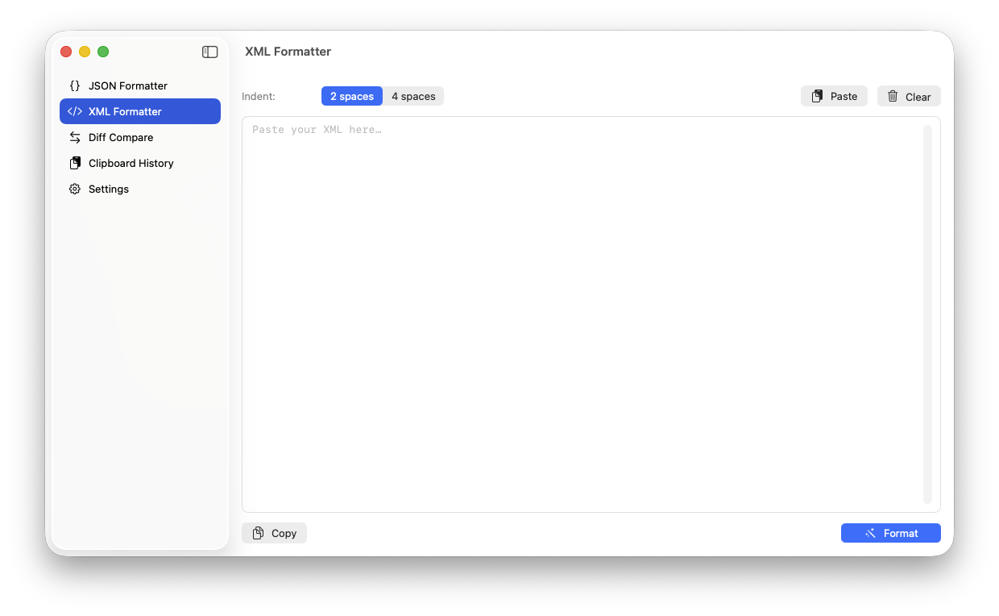
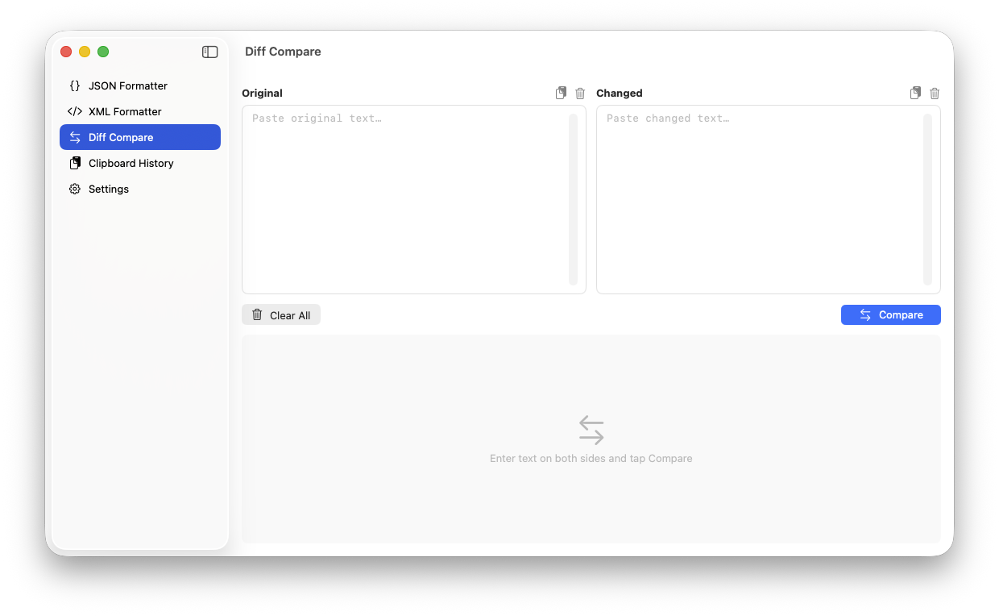
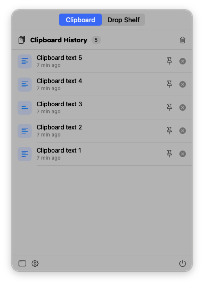
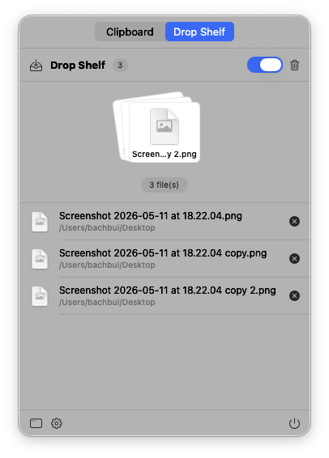

# DevPad

A native macOS developer utility — format JSON / XML / SQL, parse URLs, generate and scan QR codes, compare diffs, track clipboard history with optional plain-text "Pure Paste" stripping, and collect files in a floating drop shelf. Runs quietly in the menu bar and hides the dock icon when the main window is closed.


## Download

Grab the pre-built disk image straight from the repo: **[DevPad.dmg](DevPad.dmg)** (~3 MB).

1. Double-click the downloaded `DevPad.dmg`.
2. Drag `DevPad.app` into the `Applications` shortcut shown in the mounted volume.
3. Launch it from Applications.

> ⚠️ The build ships with ad-hoc signing (no Apple Developer ID), so the first launch hits Gatekeeper. **Right-click `DevPad.app` → Open**, then click **Open** in the confirmation dialog. macOS remembers the choice for subsequent launches.

If you'd rather build from source, see [Build & Run](#build--run) below.

## Screenshots

Listed in the same order as the sidebar.

| JSON Formatter | XML Formatter |
|:-:|:-:|
|  |  |

| SQL Formatter | URL Parser |
|:-:|:-:|
|  |  |

| QR Generator | Diff Compare |
|:-:|:-:|
|  |  |

| Clipboard History | Drop Shelf |
|:-:|:-:|
|  |  |

| Settings | |
|:-:|:-:|
|  | |

## Features

- **JSON Formatter** — paste JSON, hit Format, get pretty-printed output. Supports Minify and 2-space / 4-space / Tab indent.
- **XML Formatter** — pretty-print XML with standard indentation.
- **SQL Formatter** — tokenizer-based pretty printer. Uppercases keywords, breaks each major clause (SELECT, FROM, WHERE, JOIN, GROUP BY, …) onto its own line, indents subqueries, and aligns AND / OR. Includes a Minify mode.
- **URL Parser** — paste a URL, get every component on its own labelled row: scheme, user / password, host, port, path, query string, individual query parameters, fragment. One-click copy for any piece.
- **QR Generator** — two-mode tool. **Generate**: text/URL → QR image with configurable error-correction level, optional center-icon overlay (logo branding), save as PNG or copy to clipboard. **Scan**: drop or paste any image containing a QR code; DevPad decodes it back to text via the Vision framework, with a "open as link" shortcut for URL payloads.
- **Diff Compare** — side-by-side or unified text comparison with git-style hunks, configurable context, inline word/character-level highlighting (red/green), plus Ignore-whitespace and Ignore-case options.
- **Clipboard History** — automatically saves the last 20 clipboard entries (text + images). Pinned items appear in a separate section, persist across restarts, delete individually or clear all. Includes **Pure Paste** — an on/off toggle that strips rich-text formatting from anything you copy, so subsequent paste lands as plain text everywhere.
- **Drop Shelf** — Dropover-style floating shelf. Toggle it on and a small panel pops up whenever you start dragging files anywhere on the Mac; drop files into it, accumulate as many as you like, then drag the whole bundle out to a new destination. Multi-file drag is real AppKit `NSDraggingSource` — Finder receives every file at once.
- **Menu bar app** — clipboard icon in the macOS menu bar. Click for a tabbed popover (Clipboard / Drop Shelf), drag files out from there too.
- **Settings** — choose theme (System / Light / Dark) and language (English / Tiếng Việt). Changes apply instantly without restarting.
- **Localization** — full UI in English and Vietnamese.

## Requirements

- macOS 13.0 Ventura or later
- Xcode 15+ to build from source

## Build & Run

### Open in Xcode

```bash
open DevPad.xcodeproj
```

Press `⌘R` to build and run.

### Package as DMG

```bash
./build_dmg.sh
```

Output: `build/DevPad.dmg`. Mount the DMG and drag `DevPad.app` to Applications.

> ⚠️ The DMG is built with ad-hoc signing by default (no Apple Developer ID). On first launch you must **right-click → Open** to bypass Gatekeeper.
>
> If you have a Developer ID, run `./build_dmg.sh --signed` to use your Xcode signing identity.

## Usage

### Menu bar

After first launch, a clipboard icon appears in the macOS menu bar (top-right). Click it to open the popover, which has a segmented tab picker at the top:

- **Clipboard** tab — the 20 most recent items, pinned ones grouped on top. Click an item to copy it back to the pasteboard.
- **Drop Shelf** tab — the same files that the floating shelf and the main-window tab show. Includes a "Drag out all" handle at the top plus per-file drag, so even if the floating popup is dismissed you can still drag files out from here.
- Shared footer: **Open DevPad**, **Settings (⌘,)**, **Quit**.

### Main window

Click **Open DevPad** in the menu bar popover footer to open the main window. The sidebar has nine tabs:

| Tab | Description |
|-----|-------------|
| JSON Formatter | Paste JSON, press Format or `⌘↵` |
| XML Formatter | Paste XML, press Format or `⌘↵` |
| SQL Formatter | Paste a query, press Format or `⌘↵`. Keywords uppercased, clauses on their own lines, subqueries indented. Minify available. |
| URL Parser | Paste a URL, press Parse or `⌘↵`. Every component (scheme, host, path, query items, fragment) listed with one-click copy. |
| QR Generator | Generate QR from text or scan QR from an image. Toggle the mode at the top. |
| Diff Compare | Two text panes side-by-side, press Compare or `⌘↵`. Switch between Split / Unified view, adjust context size, toggle Ignore whitespace / case. |
| Clipboard History | Full view with a detail pane on the right; pinned items grouped on top. The header has a **Pure paste** toggle that strips rich-text formatting from copied text. |
| Drop Shelf | Toggle the feature on/off, see collected files, drag the whole bundle (or individual files) out to any destination |
| Settings | Theme, language, and about |

### SQL Formatter notes

- Keywords are matched case-insensitively and emitted in upper case (`SELECT`, `FROM`, `WHERE`, `JOIN`, …).
- Each clause-starter goes on its own line; `AND` / `OR` inside `WHERE` are indented one level past the clause.
- Comma-separated items in `SELECT` / `VALUES` / `SET` lists each get their own indented line.
- Subqueries inside `(...)` push the indent level and pop it back on `)`.
- Inline comments (`-- …`) and block comments (`/* … */`) are preserved verbatim.
- The **Minify** button collapses the query into a single space-separated line, dropping comments — useful for embedding in code.

### URL Parser notes

- Backed by Foundation's `URLComponents`, so every parse honours RFC 3986 (percent-encoding, IDN, etc.).
- All nine components are listed even when absent — empty parts are shown as `—` so it's obvious which pieces the URL doesn't carry.
- Passwords are masked (`••••••`) in the UI; the copy button still places the raw value on the pasteboard so you can paste it elsewhere.
- The query string and the parsed query items are both shown — useful for spotting duplicate keys or unusual encoding.

### QR Generator notes

- **Generate**: powered by Core Image's `CIQRCodeGenerator`. Choose the error-correction level (Low / Medium / Quartile / High) — higher correction tolerates more damage but produces a denser code. Output is upscaled with nearest-neighbour so modules stay sharp.
- **Center icon**: optionally add a small logo image (PNG/JPEG) that DevPad composites into the middle of the QR with a rounded white pad. The icon covers ~22 % of the QR side; bump the error-correction level to **Quartile** or **High** so scanners can still recover the obscured modules.
- **Save**: writes a 1024-px-wide PNG via `NSSavePanel`.
- **Copy**: places the QR `NSImage` on the system pasteboard so you can paste into Notes, Mail, Slack, etc.
- **Scan**: drag an image onto the drop zone, paste one from the clipboard, or choose a file. DevPad runs Apple's Vision framework (`VNDetectBarcodesRequest`) restricted to `.qr` symbology — no third-party dependency. If the decoded text is a URL, a one-click **Open as link** button appears.

### Pure Paste workflow

1. Open **Clipboard History** (main window or the Clipboard tab in the menu bar) and toggle **Pure paste** on. The setting persists across launches.
2. Copy text from anywhere — a styled web page, Word document, Notion, Slack, etc.
3. Paste anywhere (`⌘V`). DevPad has already replaced the rich-text payload on the system pasteboard with its plain-text fallback, so the receiving app gets unformatted text — without you needing to remember `⌘⇧V`.
4. The plain-text version is also what shows up in the clipboard history list.
5. Turn the toggle off any time to restore normal copy/paste behaviour (e.g. when you actually want to keep formatting).

### Drop Shelf workflow

1. Open the **Drop Shelf** tab in the sidebar (or the Drop Shelf tab in the menu bar) and turn on the **Enable Drop Shelf** switch.
2. Start dragging files from Finder, the Desktop, Mail, or any other source. After ~1 second of dragging, a small floating panel slides in next to the cursor.
3. Drop the files into the panel. Drag more from a different folder; they pile up in the same shelf.
4. When you're ready, grab the stack thumbnail in the panel (or in the main-window / menu-bar tab) and drag the whole bundle to a new destination. Finder receives every file in one drop.
5. Close the floating panel via its X button; the shelf stays populated. Re-open it any time from the menu-bar Drop Shelf tab.

### App lifecycle

- **Close window (red X)** → dock icon hides, app keeps running in the menu bar.
- **Reopen** → click "Open DevPad" in the menu bar popover.
- **Quit** → Quit button in the menu bar popover, or `⌘Q` while the window is focused.

This follows the standard menu-bar app pattern (similar to Maccy, Bartender). Unlike regular apps, closing the window does **not** quit DevPad.

### Keyboard shortcuts

| Key | Action |
|-----|--------|
| `⌘↵` | Run the primary action of the current tab — Format (JSON / XML / SQL), Parse (URL), Generate QR, or Compare (Diff) |
| `⌘,` | Open Settings |
| `⌘Q` | Quit (only when the window is focused) |

## Project structure

```
DevPad/
├── DevPad.xcodeproj/                # Xcode project file
├── DevPad/                          # Source code
│   ├── DevPadApp.swift              # App entry point, scene definitions
│   ├── AppDelegate.swift            # Window/dock activation policy
│   ├── MainWindowView.swift         # Sidebar navigation
│   ├── Models/
│   │   ├── AppSettings.swift        # Theme + language store (persisted)
│   │   └── ClipboardItem.swift      # Codable clipboard entry
│   ├── Utilities/
│   │   ├── JSONFormatter.swift      # Pretty printer + minifier
│   │   ├── XMLFormatter.swift       # Tokenizer-based pretty printer
│   │   ├── SQLFormatter.swift       # Tokenizer-based SQL pretty printer + minifier
│   │   ├── QRCode.swift             # CoreImage generate + Vision decode
│   │   ├── DiffEngine.swift         # LCS line/word diff + hunk grouping
│   │   ├── ClipboardManager.swift   # NSPasteboard polling + persistence + Pure Paste
│   │   ├── DropShelfManager.swift   # Shared state for the Drop Shelf
│   │   ├── DropShelfMonitor.swift   # Global drag detection + floating panel
│   │   └── Localization.swift       # EN/VI in-memory string catalog
│   ├── Views/
│   │   ├── JSONFormatterView.swift
│   │   ├── XMLFormatterView.swift
│   │   ├── SQLFormatterView.swift
│   │   ├── URLParserView.swift          # Paste URL → labelled components
│   │   ├── QRGeneratorView.swift        # Generate/scan QR codes
│   │   ├── DiffCompareView.swift
│   │   ├── ClipboardHistoryView.swift   # Full window detail view (Pure Paste toggle)
│   │   ├── ClipboardMenuBarView.swift   # Tabbed menu-bar popover (Clipboard + Drop Shelf)
│   │   ├── DropShelfView.swift          # Drop Shelf sidebar tab
│   │   ├── DropShelfPanelView.swift     # Floating popup content
│   │   ├── MultiFileDragSource.swift    # AppKit drag-source bridge (multi-file)
│   │   └── SettingsView.swift
│   ├── Assets.xcassets/
│   ├── DevPad.entitlements          # App sandbox entitlements
│   └── Preview Content/
├── docs/screenshots/                # README screenshots
├── build_dmg.sh                     # Release build + DMG packaging
├── LICENSE
└── README.md
```

## Implementation notes

- **Localization** — strings are stored in an in-memory dictionary (`Localization.swift`) rather than `Localizable.strings`, so the language can switch at runtime without a restart. Every view reads `settings.t("key")` via `@EnvironmentObject`; changing `language` triggers a `@Published` re-render.
- **Clipboard polling** — a `Timer` checks `NSPasteboard.general.changeCount` every 0.6 s. This trades a small amount of CPU for low latency.
- **Persistence** — clipboard history is serialized via `Codable` into `UserDefaults`. Images are stored as PNG bytes.
- **Diff algorithm** — classic LCS (`O(m·n)`) for line-level diffing. For each modified line, a second LCS pass runs at token level (contiguous alphanumerics = one token, each punctuation character = its own token) to produce accurate inline highlights. Hunks group changes with configurable context lines, collapsing long unchanged spans into "N lines hidden" markers — same behaviour as `git diff -U<n>`.
- **SQL formatter** — pure-Swift tokenizer that recognises keywords (case-insensitive matching, uppercased on emit), identifiers, numbers, strings (`'...'` / `"..."` with escaped doubled quotes), line and block comments, operators, and punctuation. Emission rules: a newline before every clause-starter keyword (SELECT, FROM, WHERE, JOIN, …); commas in a SELECT/VALUES/SET list break to a new column-line; subqueries `(…)` push the indent level. The tokenizer-then-emit approach is simple to reason about and easy to extend with new keywords.
- **URL parser** — defers entirely to Foundation's `URLComponents`. The view's only job is to flatten the parsed components onto a fixed list of rows so the structure is glanceable. Query items are rendered separately from the raw query string so duplicate keys and unusual encoding are obvious at a glance.
- **QR code** — generation uses CoreImage's `CIQRCodeGenerator` filter (no third-party deps); the raw 21–177-module image is upscaled with `CGAffineTransform(scaleX:y:)` and `.interpolation(.none)` so the modules stay crisp. When a center icon is provided, the QR is composited inside an `NSImage.lockFocus()` block: the QR is drawn first, then a rounded white pad, then the icon — yielding the standard logo-in-the-middle look without needing a third-party library. Decoding uses Vision's `VNDetectBarcodesRequest` filtered to `.qr`; the first observation's `payloadStringValue` is the decoded text. Both calls are synchronous — the workload is tiny and avoids state-management overhead.
- **Pure Paste** — when toggled on, `ClipboardManager` inspects the system pasteboard each tick. If the clipboard advertises any rich-text representation (`.rtf`, `.rtfd`, `.html`, `WebArchivePboardType`, …) alongside the plain string, the manager overwrites the pasteboard with just the plain text and records the plain version in history. A `suppressNextChange` flag prevents the rewrite from being re-processed as a brand-new clipboard event.
- **Drop Shelf detection** — an `NSEvent` global monitor watches `.leftMouseDragged` events from other apps and inspects `NSPasteboard(.drag).changeCount`. The count only advances when a real drag-and-drop session starts, so plain mouse drags over empty space are ignored. The panel appears after a short delay (≈1 s) so quick accidental drags don't flash it.
- **Multi-file drag-out** — SwiftUI's `.onDrag` returns a single `NSItemProvider`, which can't represent a set of files. `MultiFileDragSource` wraps the dragged content in an `NSView` that conforms to `NSDraggingSource` and starts a session with one `NSDraggingItem` per URL. Finder treats them as a single multi-file drop.
- **Floating shelf window** — the popup is an `NSPanel` with `.nonactivatingPanel + .borderless` styling, pinned to `.floating` level next to the cursor. It never steals focus from the ongoing drag. The file-stack view opts out of window-movement (`mouseDownCanMoveWindow = false`) so dragging it drags files, not the panel.
- **Shared Drop Shelf state** — `DropShelfManager.shared` (the URL list) and `AppSettings.shared.dropShelfEnabled` (the toggle) are the single source of truth. The floating popup, the main-window sidebar tab, and the menu-bar Drop Shelf tab all observe the same singletons, so adding / removing a file in any surface is reflected everywhere immediately.
- **Menu bar pattern** — `applicationShouldTerminateAfterLastWindowClosed = false` combined with dynamic activation policy (`.regular` ↔ `.accessory`) keeps the app alive after the window closes.
- **No `.xcstrings`** — intentional, for the runtime-switch reason above. Trade-off: strings cannot be exported to translators via Xcode String Catalog. If more languages are needed in the future, migrating to `.xcstrings` with a Bundle override is straightforward.

## License

Copyright © 2026 bachbnt. All rights reserved.

See the [LICENSE](LICENSE) file for details.
