# DevPad

A native macOS developer utility — format JSON / XML / SQL, parse URLs, generate and scan QR codes, decode/sign/verify JWTs, test regular expressions, hash text and files, compare diffs, track clipboard history with optional plain-text "Pure Paste" stripping, and collect files in a floating drop shelf. Runs quietly in the menu bar and hides the dock icon when the main window is closed.


## Download

Grab the latest pre-built disk image from the GitHub Releases page: **[DevPad.dmg](https://github.com/bachbnt/dev-pad/releases/latest/download/DevPad.dmg)** (~3 MB). This link always points to the most recent release — no need to update the README on every release.

1. Double-click the downloaded `DevPad.dmg`.
2. Drag `DevPad.app` into the `Applications` shortcut shown in the mounted volume.
3. Launch it from Applications.

> ⚠️ The build ships with ad-hoc signing (no Apple Developer ID), so the first launch hits Gatekeeper. **Right-click `DevPad.app` → Open**, then click **Open** in the confirmation dialog. macOS remembers the choice for subsequent launches.

Older versions are listed on the [releases page](https://github.com/bachbnt/dev-pad/releases). If you'd rather build from source, see [Build & Run](#build--run) below.

## Screenshots

Listed in the same order as the sidebar.

| JSON Formatter | XML Formatter | SQL Formatter |
|:-:|:-:|:-:|
| 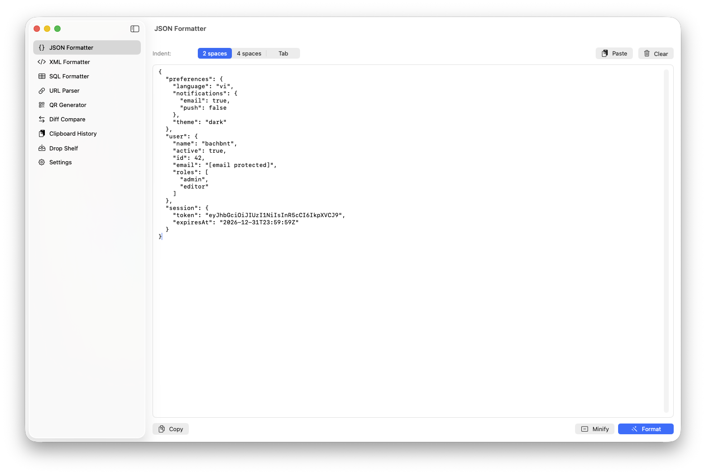 | 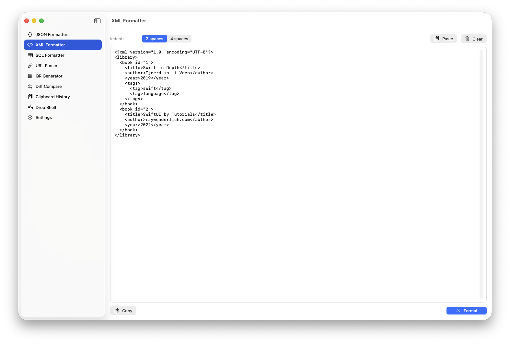 | 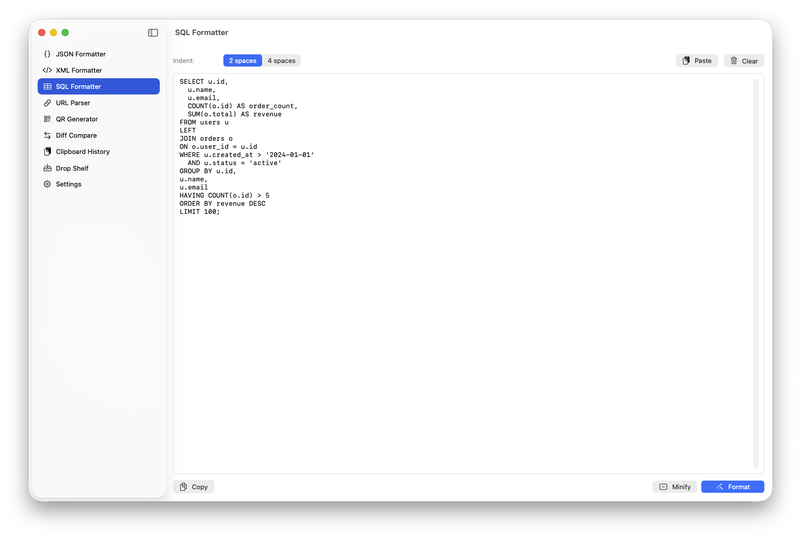 |

| URL Parser | QR Generator | JWT Inspector |
|:-:|:-:|:-:|
| 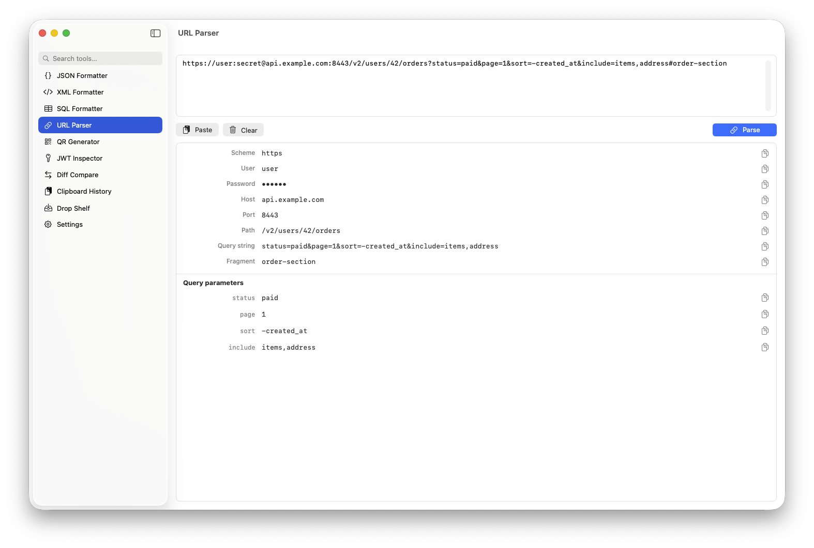 | 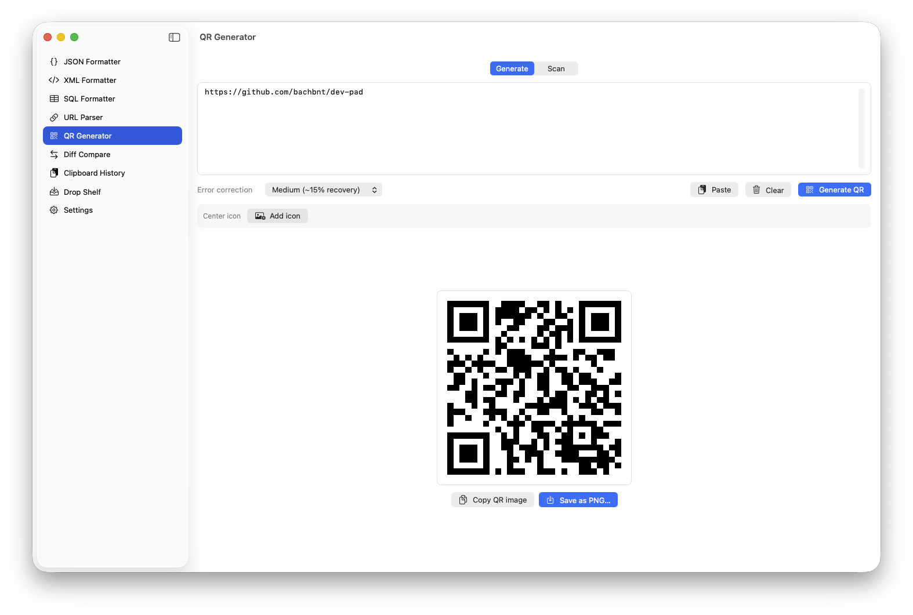 | 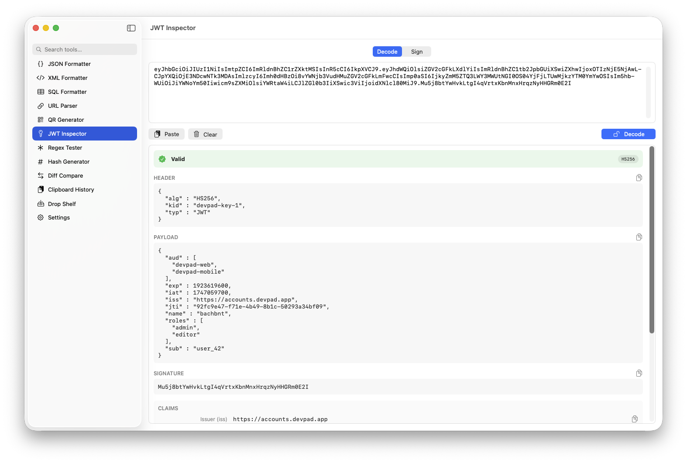 |

| Regex Tester | Hash Generator | Diff Compare |
|:-:|:-:|:-:|
| 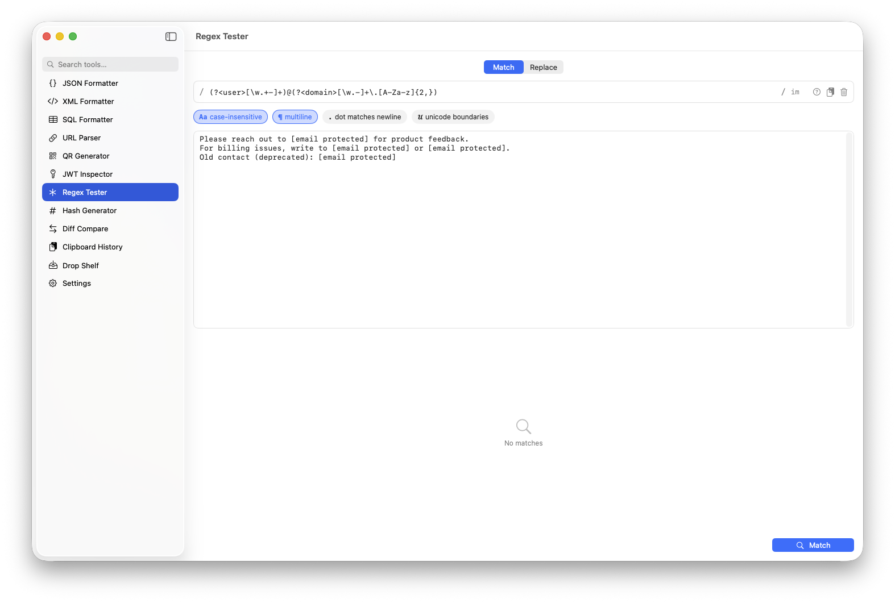 | 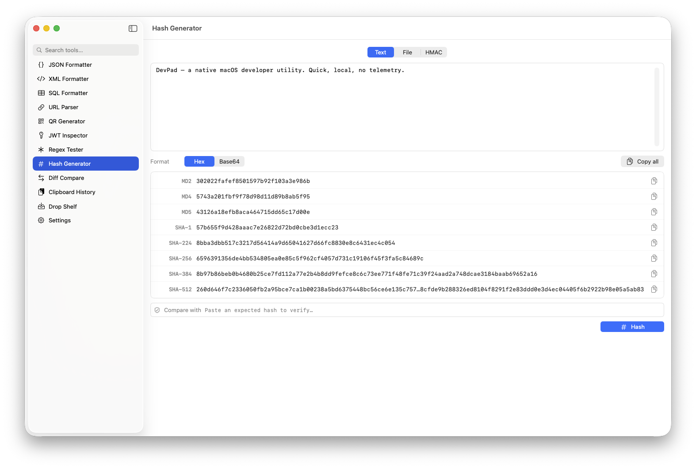 | 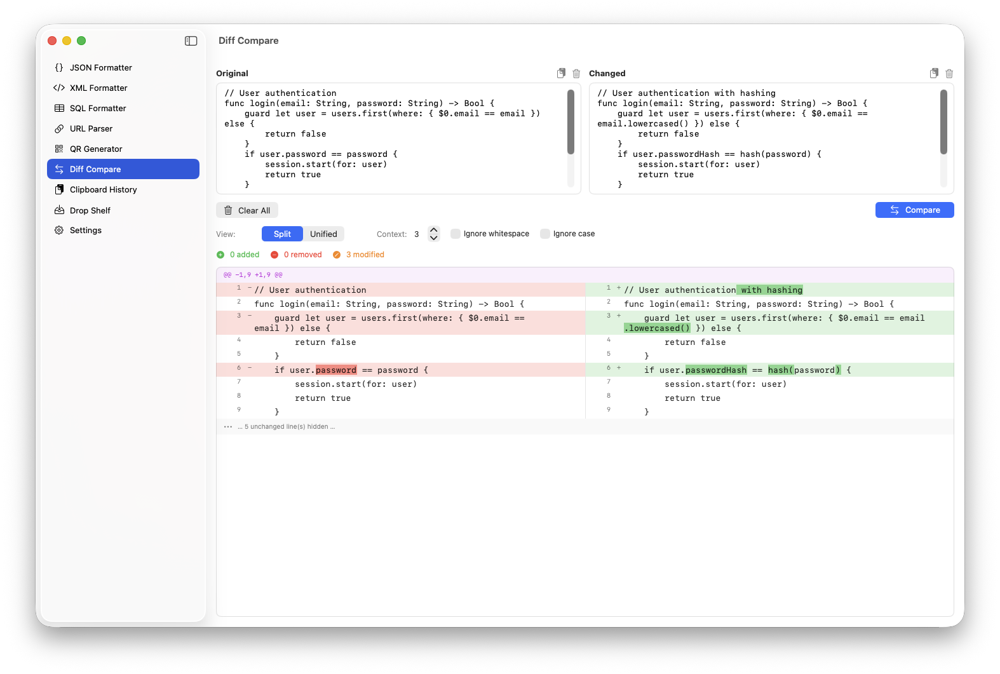 |

| Clipboard History | Drop Shelf | Settings |
|:-:|:-:|:-:|
| 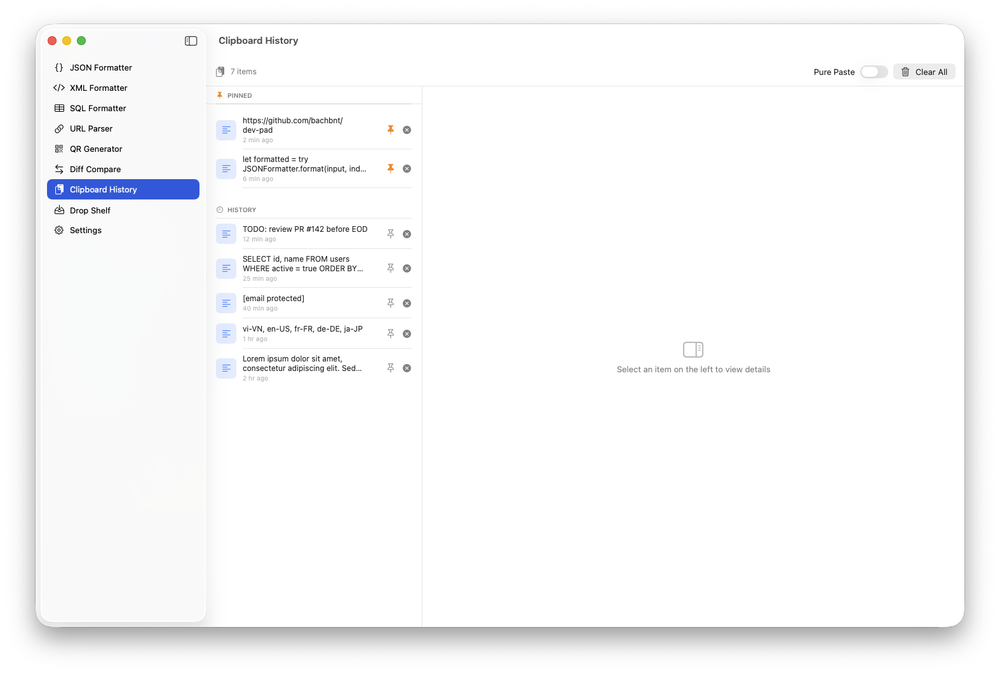 | 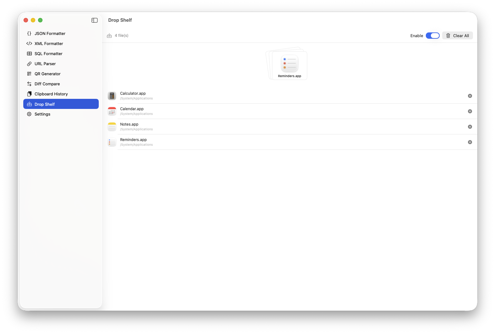 | 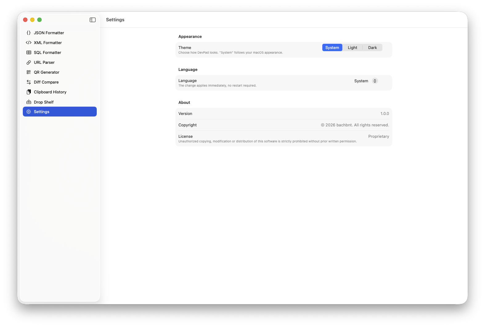 |

## Features

- **JSON Formatter** — paste JSON, hit Format, get pretty-printed output. Supports Minify and 2-space / 4-space / Tab indent.
- **XML Formatter** — pretty-print XML with standard indentation.
- **SQL Formatter** — tokenizer-based pretty printer. Uppercases keywords, breaks each major clause (SELECT, FROM, WHERE, JOIN, GROUP BY, …) onto its own line, indents subqueries, and aligns AND / OR. Includes a Minify mode.
- **URL Parser** — paste a URL, get every component on its own labelled row: scheme, user / password, host, port, path, query string, individual query parameters, fragment. One-click copy for any piece.
- **QR Generator** — two-mode tool. **Generate**: text/URL → QR image with configurable error-correction level, optional center-icon overlay (logo branding), save as PNG or copy to clipboard. **Scan**: two input sources via a sub-picker — drop / paste / open any image containing a QR code, or point your webcam at one for live continuous scanning. Both sources use Vision's `VNDetectBarcodesRequest` so detection quality is identical. URL payloads get an "open as link" shortcut.
- **JWT Inspector** — two-mode tool. **Decode**: paste a JWT, see the header / payload / signature laid out, standard claims (`iss` / `sub` / `aud` / `exp` / `iat` / `nbf` / `jti`) parsed into a readable table, status badge tracking expiry / not-before, and an optional verify panel. Verify supports HS256/384/512 with a plain-string secret, plus RS256/384/512 and ES256/384/512 with a PEM-encoded public key. **Sign**: write your own header + payload JSON, pick an HMAC algorithm (HS256/384/512), supply a secret, get a signed token back. RSA/ECDSA private-key signing is intentionally left to CLI tooling.
- **Regex Tester** — live regex playground. Type a pattern + test text, every match is painted inline in real attributed `NSTextView`. Toggle flags as pills (case-insensitive `i`, multiline `m`, dot-matches-newline `s`, unicode boundaries `u`). Match list below shows full match plus every capture group (including `(?<name>…)` named groups) with copy buttons. Flip to **Replace** mode to preview the rewritten text and see how many matches were substituted (`$1`, `$&`, etc.). Built-in cheat sheet popover for the most common regex tokens.
- **Hash Generator** — three-mode tool. **Text**: type or paste a string, see every common digest (MD2, MD4, MD5, SHA-1, SHA-224, SHA-256, SHA-384, SHA-512) live in one table. **File**: drop a file (or pick one) and DevPad streams each algorithm off the main thread so even multi-GB files don't freeze the UI. **HMAC**: message + secret key + SHA-1/256/384/512 → authenticated digest (HMAC-SHA1 included because it's still the default for TOTP, Google Authenticator, AWS Sig v2, and a handful of legacy webhook signers). Toggle output format between Hex and Base64, paste an expected hash into "Compare with" to highlight which algorithm matches, copy individual rows or "Copy all".
- **Diff Compare** — side-by-side or unified text comparison with git-style hunks, configurable context, inline word/character-level highlighting (red/green), plus Ignore-whitespace and Ignore-case options.
- **Clipboard History** — automatically saves the last 20 clipboard entries (text + images). Pinned items appear in a separate section, persist across restarts, delete individually or clear all. Includes **Pure Paste** — an on/off toggle that strips rich-text formatting from anything you copy, so subsequent paste lands as plain text everywhere.
- **Drop Shelf** — Dropover-style floating shelf. Toggle it on and a small panel pops up whenever you start dragging files anywhere on the Mac; drop files into it, accumulate as many as you like, then drag the whole bundle out to a new destination. Drag-out semantics are **move**: when you deliver the files somewhere else, the shelf clears those entries automatically (in the popup, the in-app tab, and the menu-bar tab — all three views share state). The popup also auto-dismisses when the drop lands outside it, so it never lingers after a successful drag. Multi-file drag is real AppKit `NSDraggingSource` — Finder receives every file at once.
- **Menu bar app** — clipboard icon in the macOS menu bar. Click for a tabbed popover (Clipboard / Drop Shelf), drag files out from there too.
- **Sidebar search** — instant filter at the top of the sidebar; type any part of a tool's name in the current language to jump to it.
- **Settings** — choose theme (System / Light / Dark) and language (English / Tiếng Việt). Changes apply instantly without restarting.
- **Localization** — full UI in English and Vietnamese, every `settings.t(…)` key has both translations.

## Requirements

- macOS 13.0 Ventura or later
- Xcode 15+ to build from source

## Build & Run

### Open in Xcode

```bash
open DevPad.xcodeproj
```

Press `⌘R` to build and run.

### Package as DMG

```bash
./build_dmg.sh
```

Output: `build/DevPad.dmg`. Mount the DMG and drag `DevPad.app` to Applications.

> ⚠️ The DMG is built with ad-hoc signing by default (no Apple Developer ID). On first launch you must **right-click → Open** to bypass Gatekeeper.
>
> If you have a Developer ID, run `./build_dmg.sh --signed` to use your Xcode signing identity.

The Release configuration is tuned for smallest binary: `SWIFT_OPTIMIZATION_LEVEL = -Osize`, `LLVM_LTO = YES`, `DEAD_CODE_STRIPPING = YES`, full symbol stripping (`STRIP_INSTALLED_PRODUCT` / `STRIP_SWIFT_SYMBOLS` / `STRIP_STYLE = all`), `DEPLOYMENT_POSTPROCESSING = YES`, and `ASSETCATALOG_COMPILER_OPTIMIZATION = space`. The DMG itself is packaged with `hdiutil -format ULFO` (lzfse) instead of the legacy UDZO zlib — comfortably within the macOS 13+ deployment target. The `DemoMode` injection path is `#if DEBUG`-only so Release builds skip the screenshot-seeding entirely.

### Cutting a release

`release.sh` wraps the whole "bump + build + tag + publish" flow into one command. It runs entirely on the local machine — no CI, no cost. Requires the [`gh` CLI](https://cli.github.com) authenticated once via `gh auth login`.

```bash
./release.sh v1.0.0                          # ad-hoc signed
./release.sh v1.0.0 --signed                 # use Xcode Developer ID
./release.sh v1.1.0-beta1 --prerelease       # mark as pre-release
./release.sh v1.0.0 --notes "Hotfix: …"      # supply notes instead of auto-generated
./release.sh v1.0.0 --draft                  # create as draft, finish on the web UI
./release.sh v1.2.0 --yes                    # skip the version-bump confirm prompt
```

Pre-flight checks (any failure aborts before building, so a botched call doesn't waste a 90-second Xcode build):

- Version is semver `vX.Y.Z` (optionally `-suffix`).
- Working tree is clean — no uncommitted changes.
- Currently on a real branch (not detached HEAD).
- Tag doesn't already exist locally or on `origin`.
- `gh` CLI is installed and authenticated.

If those pass, the script then:

1. **Bumps the Xcode version**. `MARKETING_VERSION` in `project.pbxproj` is set to the stripped tag (`v1.1.0` → `1.1.0`) and `CURRENT_PROJECT_VERSION` (the build number) is incremented by 1. The diff is shown and confirmed before commit (skip with `--yes`). The bump is committed and pushed to the current branch, so the tag points at the commit that actually carries the new version — the DMG's About dialog and the GitHub release tag always agree.
2. **Builds the DMG** via `build_dmg.sh` (ad-hoc or `--signed`).
3. **Tags + pushes** the new annotated tag to `origin`.
4. **Creates the GitHub release** with `gh release create`, attaching the DMG. Release notes are auto-generated from PRs / commits since the previous tag unless you pass `--notes`.

The attached DMG is always reachable at the stable [`releases/latest/download/DevPad.dmg`](https://github.com/bachbnt/dev-pad/releases/latest/download/DevPad.dmg) URL, so the README link doesn't need updating between releases.

### Demo mode (Debug builds only)

For maintainers who want to grab marketing screenshots quickly, launch a **Debug** build with a flag that pre-fills every tab with curated sample content (formatted JSON, an XML library, a long SQL query, a parsed URL, a QR text, a signed JWT, an email-finding regex with named groups, hash sample text, a multi-line diff, mock clipboard items, drop-shelf files):

```bash
# Xcode: Edit Scheme → Run → Arguments → add "--demo-fill"
# or, after building Debug:
DEVPAD_DEMO_FILL=1 open /path/to/Debug/DevPad.app
```

Each tab only injects its sample if its own state is currently empty, so you can still type over the placeholders during a real session. Clipboard / Drop Shelf seeds are skipped when those stores already contain real data — DevPad won't ever overwrite your actual history.

Release builds compile `DemoMode.isOn` to a constant `false` (via `#if DEBUG`), so the entire injection path is dead-code-stripped from the shipping binary.

## Usage

### Menu bar

After first launch, a clipboard icon appears in the macOS menu bar (top-right). Click it to open the popover, which has a segmented tab picker at the top:

- **Clipboard** tab — the 20 most recent items, pinned ones grouped on top. Click an item to copy it back to the pasteboard.
- **Drop Shelf** tab — the same files that the floating shelf and the main-window tab show. Includes a "Drag out all" handle at the top plus per-file drag, so even if the floating popup is dismissed you can still drag files out from here.
- Shared footer: **Open DevPad**, **Settings (⌘,)**, **Quit**.

### Main window

Click **Open DevPad** in the menu bar popover footer to open the main window. The sidebar has twelve tabs and a search field at the top so you can jump straight to a tool by typing its name (works in either language):

| Tab | Description |
|-----|-------------|
| JSON Formatter | Paste JSON, press Format or `⌘↵` |
| XML Formatter | Paste XML, press Format or `⌘↵` |
| SQL Formatter | Paste a query, press Format or `⌘↵`. Keywords uppercased, clauses on their own lines, subqueries indented. Minify available. |
| URL Parser | Paste a URL, press Parse or `⌘↵`. Every component (scheme, host, path, query items, fragment) listed with one-click copy. |
| QR Generator | Generate QR from text, or scan a QR from an image **or** your webcam. Top picker swaps Generate / Scan; Scan has a sub-picker for Image / Camera. |
| JWT Inspector | Decode a JWT into header / payload / signature with parsed claims and a status badge, or sign a fresh HMAC token. Optional verify panel supports HS\*/RS\*/ES\*. |
| Regex Tester | Type a regex + test string, press Match or `⌘↵`. Matches highlight inline, capture groups (and `(?<name>…)`) listed below. Replace mode previews the rewrite via the **Apply** button. Cheat sheet popover for common tokens. |
| Hash Generator | Hash text, files, or HMAC-authenticate a message. Eight algorithms (MD2 / MD4 / MD5 / SHA-1 / SHA-224 / SHA-256 / SHA-384 / SHA-512) shown at once, Hex or Base64 output, "Compare with" field for verification. Press **Hash** / **Generate** (`⌘↵`) in Text and HMAC modes; File mode hashes automatically on drop. |
| Diff Compare | Two text panes side-by-side, press Compare or `⌘↵`. Switch between Split / Unified view, adjust context size, toggle Ignore whitespace / case. |
| Clipboard History | Full view with a detail pane on the right; pinned items grouped on top. The header has a **Pure paste** toggle that strips rich-text formatting from copied text. |
| Drop Shelf | Toggle the feature on/off, see collected files, drag the whole bundle (or individual files) out to any destination |
| Settings | Theme, language, and about |

### SQL Formatter notes

- Keywords are matched case-insensitively and emitted in upper case (`SELECT`, `FROM`, `WHERE`, `JOIN`, …).
- Each clause-starter goes on its own line; `AND` / `OR` inside `WHERE` are indented one level past the clause.
- Comma-separated items in `SELECT` / `VALUES` / `SET` lists each get their own indented line.
- Subqueries inside `(...)` push the indent level and pop it back on `)`.
- Inline comments (`-- …`) and block comments (`/* … */`) are preserved verbatim.
- The **Minify** button collapses the query into a single space-separated line, dropping comments — useful for embedding in code.

### URL Parser notes

- Backed by Foundation's `URLComponents`, so every parse honours RFC 3986 (percent-encoding, IDN, etc.).
- All nine components are listed even when absent — empty parts are shown as `—` so it's obvious which pieces the URL doesn't carry.
- Passwords are masked (`••••••`) in the UI; the copy button still places the raw value on the pasteboard so you can paste it elsewhere.
- The query string and the parsed query items are both shown — useful for spotting duplicate keys or unusual encoding.

### QR Generator notes

- **Generate**: powered by Core Image's `CIQRCodeGenerator`. Choose the error-correction level (Low / Medium / Quartile / High) — higher correction tolerates more damage but produces a denser code. Output is upscaled with nearest-neighbour so modules stay sharp.
- **Center icon**: optionally add a small logo image (PNG/JPEG) that DevPad composites into the middle of the QR with a rounded white pad. The icon covers ~22 % of the QR side; bump the error-correction level to **Quartile** or **High** so scanners can still recover the obscured modules.
- **Save**: writes a 1024-px-wide PNG via `NSSavePanel`.
- **Copy**: places the QR `NSImage` on the system pasteboard so you can paste into Notes, Mail, Slack, etc.
- **Scan from image**: drag an image onto the drop zone, paste one from the clipboard, or choose a file. DevPad runs Apple's Vision framework (`VNDetectBarcodesRequest`) restricted to `.qr` symbology — no third-party dependency. If the decoded text is a URL, a one-click **Open as link** button appears.
- **Scan with camera**: switch the sub-picker to **Camera**. DevPad asks for camera permission on first use (declared via `NSCameraUsageDescription` + the `com.apple.security.device.camera` sandbox entitlement). Once granted, an `AVCaptureSession` streams the built-in webcam through `AVCaptureVideoDataOutput`, and each frame is fed to the same Vision `VNDetectBarcodesRequest` (filtered to `.qr`) the image scanner uses — scanning is continuous, so the decoded text updates as soon as the camera sees a different QR code. The session pauses automatically when you leave the tab so the webcam LED isn't left on. If the user previously denied access, an inline **Open System Settings** button jumps straight to the Privacy & Security pane.

### JWT Inspector notes

- **Decode** parses the three dot-separated base64url segments locally — nothing is sent over the network. Header and payload are reformatted with sorted keys for stable diff-friendly output.
- **Status badge** combines `exp` and `nbf` into a single readable line: *Valid*, *Expired (relative date)*, *Not active until …*, or *No expiration*. Times honour the current locale and the macOS time zone.
- **Standard claims** — `iss`, `sub`, `aud` (string or array), `exp`, `iat`, `nbf`, `jti` — each get their own row with a one-click copy button. Missing claims show as `—`.
- **Verify (HMAC)** — for `HS256/384/512` paste the signing secret as a plain string. DevPad uses CryptoKit's constant-time `HMAC.isValidAuthenticationCode`.
- **Verify (asymmetric)** — for `RS256/384/512` or `ES256/384/512` paste the PEM-encoded **public key**. DevPad parses the SPKI wrapper itself (BIT STRING extraction) and converts the JWT's `R||S` ECDSA signature to ASN.1 DER before calling `SecKeyVerifySignature`. `RSASSA-PKCS1-v1_5` and X9.62 ECDSA are both supported.
- **Sign** — HMAC only. Header and payload are canonicalised (sorted keys, no escaped slashes) before signing. The `alg` field in the header is kept in sync with the algorithm picker automatically. If you need to sign an RS\*/ES\* token, use a CLI like `step` or `jwt-cli` with the private key — DevPad deliberately keeps private-key parsing out of the app to avoid misuse.
- **`alg: none`** tokens are refused on verify rather than silently accepted — a long-standing JWT footgun.

### Regex Tester notes

- **Explicit action** — press **Match** (or **Apply** in Replace mode) or hit `⌘↵`. Nothing leaves the app; the engine is `NSRegularExpression`.
- **Inline highlight** uses a custom `NSTextView` wrapper because SwiftUI's `TextEditor` on macOS 13 doesn't reliably paint attributed backgrounds. The wrapper preserves the caret across re-renders so highlights don't cost you your typing position.
- **Flag pills** — `i` (case-insensitive), `m` (anchors match line starts/ends), `s` (dot matches newline), `u` (Unicode word boundaries for `\b`, `\w`, etc.). Active flags are also echoed in the `/pattern/imsu` strip next to the pattern field.
- **Capture groups** — every numbered group is listed under each match. Named groups `(?<name>…)` / `(?'name'…)` / `(?P<name>…)` display the name instead of the index. Groups that didn't participate in the match show as `(no match)`.
- **Replace mode** uses NSRegularExpression's template language: `$1`, `$2`, `$<name>`, `$&` for the full match, `\$` for a literal dollar. The "Replaced N match(es)" chip is computed from the un-replaced count, so it reflects what was actually substituted.
- **Cheat sheet** — popover-style quick reference. Doesn't try to be exhaustive; it covers the tokens you'll reach for in 90 % of one-off testing.
- **Error reporting** — invalid patterns surface the message from `NSRegularExpression` verbatim (usually pinpointing the offending character), keeping the test text untouched so you can fix and continue.

### Hash Generator notes

- **All algorithms at once** — Text and File modes always compute MD2, MD4, MD5, SHA-1, SHA-224, SHA-256, SHA-384, and SHA-512 in parallel so you don't have to flip between them. CryptoKit covers the modern SHA family + MD5/SHA-1 (via `Insecure`); MD2, MD4, and SHA-224 come from `CommonCrypto`. No third-party dependencies.
- **Legacy algorithms** — MD2, MD4, MD5, SHA-1 are cryptographically broken and present only so you can *inspect* hashes coming from legacy systems (old CRC fields, deprecated protocols, etc.). Don't use them for new security-sensitive work; SHA-256 or stronger is the floor for that.
- **File streaming** — File mode reads in 1 MB chunks and feeds them into the hash function incrementally (`.update(data:)` then `.finalize()`), so memory stays bounded for any file size. Hashing runs on a detached `Task`; the UI shows a per-row "Hashing…" spinner until each digest lands.
- **HMAC** — message + secret key authenticate with SHA-1/256/384/512 via CryptoKit's constant-time `HMAC<H>` (using `Insecure.SHA1` for the SHA-1 variant). HMAC-MD2 / MD4 / MD5 / SHA-224 are intentionally omitted; if you really need them, reach for `openssl dgst -hmac …` instead.
- **Compare with** — paste a hash from a download page / changelog / build manifest, and the matching row gets a green ✓ badge plus a tinted background. The comparison is case-insensitive, ignores whitespace, and strips common separators (`:` / `-`) so formatting differences don't trip it up.
- **Output format** — toggle between lowercase hex (default) and Base64. Both representations are computed from the same raw digest bytes, so switching never re-hashes the input.
- **Copy** — per-row copy or "Copy all" which produces a multi-line `ALGO: digest` block that's safe to paste into a README or changelog.

### Pure Paste workflow

1. Open **Clipboard History** (main window or the Clipboard tab in the menu bar) and toggle **Pure paste** on. The setting persists across launches.
2. Copy text from anywhere — a styled web page, Word document, Notion, Slack, etc.
3. Paste anywhere (`⌘V`). DevPad has already replaced the rich-text payload on the system pasteboard with its plain-text fallback, so the receiving app gets unformatted text — without you needing to remember `⌘⇧V`.
4. The plain-text version is also what shows up in the clipboard history list.
5. Turn the toggle off any time to restore normal copy/paste behaviour (e.g. when you actually want to keep formatting).

### Drop Shelf workflow

1. Open the **Drop Shelf** tab in the sidebar (or the Drop Shelf tab in the menu bar) and turn on the **Enable Drop Shelf** switch.
2. Start dragging files from Finder, the Desktop, Mail, or any other source. After ~1 second of dragging, a small floating panel slides in next to the cursor.
3. Drop the files into the panel. Drag more from a different folder; they pile up in the same shelf.
4. When you're ready, grab the stack thumbnail (in the panel, the main-window tab, or the menu-bar tab) and drag the whole bundle to a new destination. Finder receives every file in one drop, and the delivered files are removed from the shelf — drag-out is treated as a **move**, not a copy.
5. **Auto-dismiss**: the floating panel goes away on its own as soon as a drop lands outside of it — whether that was the original drag from Finder that you redirected, or a drag-out from the panel itself. If you start a drag-out from the panel and then change your mind (Esc, or release on an invalid target), the panel stays put so you can try again. The manual **X** button also still works for explicit dismissal.
6. The shelf contents persist across panel dismissals — re-open from the menu-bar Drop Shelf tab or the main-window Drop Shelf sidebar any time. All three surfaces (popup, in-app, menu bar) read and write the same shared state.

### App lifecycle

- **Close window (red X)** → dock icon hides, app keeps running in the menu bar.
- **Reopen** → click "Open DevPad" in the menu bar popover.
- **Quit** → Quit button in the menu bar popover, or `⌘Q` while the window is focused.

This follows the standard menu-bar app pattern (similar to Maccy, Bartender). Unlike regular apps, closing the window does **not** quit DevPad.

### Keyboard shortcuts

| Key | Action |
|-----|--------|
| `⌘↵` | Run the primary action of the current tab — Format (JSON / XML / SQL), Parse (URL), Generate QR, Decode / Sign (JWT), Match / Apply (Regex), Hash / Generate (Hash text & HMAC), or Compare (Diff). |
| `⌘,` | Open Settings |
| `⌘Q` | Quit (only when the window is focused) |

## Project structure

```
DevPad/
├── DevPad.xcodeproj/                # Xcode project file
├── DevPad/                          # Source code
│   ├── DevPadApp.swift              # App entry point, scene definitions
│   ├── AppDelegate.swift            # Window/dock activation policy
│   ├── MainWindowView.swift         # Sidebar navigation
│   ├── Models/
│   │   ├── AppSettings.swift        # Theme + language store (persisted)
│   │   └── ClipboardItem.swift      # Codable clipboard entry
│   ├── Utilities/
│   │   ├── JSONFormatter.swift      # Pretty printer + minifier
│   │   ├── XMLFormatter.swift       # Tokenizer-based pretty printer
│   │   ├── SQLFormatter.swift       # Tokenizer-based SQL pretty printer + minifier
│   │   ├── QRCode.swift             # CoreImage generate + Vision decode
│   │   ├── QRCamera.swift           # AVCaptureSession → AVCaptureVideoDataOutput → Vision
│   │   ├── JWT.swift                # JWT decode + HMAC sign + HMAC/RSA/ECDSA verify
│   │   ├── RegexEngine.swift        # NSRegularExpression wrapper + named-group parser
│   │   ├── Hashing.swift            # CryptoKit hashes + HMAC + streaming file hash
│   │   ├── DiffEngine.swift         # LCS line/word diff + hunk grouping
│   │   ├── ClipboardManager.swift   # NSPasteboard polling + persistence + Pure Paste
│   │   ├── DropShelfManager.swift   # Shared state for the Drop Shelf
│   │   ├── DropShelfMonitor.swift   # Global drag detection + floating panel
│   │   ├── DemoMode.swift           # `--demo-fill` screenshot seeding
│   │   └── Localization.swift       # EN/VI in-memory string catalog
│   ├── Views/
│   │   ├── JSONFormatterView.swift
│   │   ├── XMLFormatterView.swift
│   │   ├── SQLFormatterView.swift
│   │   ├── URLParserView.swift          # Paste URL → labelled components
│   │   ├── QRGeneratorView.swift        # Generate/scan QR codes
│   │   ├── JWTInspectorView.swift       # Decode / sign / verify JWTs
│   │   ├── RegexTesterView.swift        # Live regex matcher + replace mode + cheatsheet
│   │   ├── HashGeneratorView.swift      # Hash text / files / HMAC with compare-with
│   │   ├── DiffCompareView.swift
│   │   ├── ClipboardHistoryView.swift   # Full window detail view (Pure Paste toggle)
│   │   ├── ClipboardMenuBarView.swift   # Tabbed menu-bar popover (Clipboard + Drop Shelf)
│   │   ├── DropShelfView.swift          # Drop Shelf sidebar tab
│   │   ├── DropShelfPanelView.swift     # Floating popup content
│   │   ├── MultiFileDragSource.swift    # AppKit drag-source bridge (multi-file)
│   │   └── SettingsView.swift
│   ├── Assets.xcassets/
│   ├── DevPad.entitlements          # App sandbox entitlements
│   └── Preview Content/
├── docs/screenshots/                # README screenshots
├── build_dmg.sh                     # Release build + DMG packaging
├── release.sh                       # Tag + GitHub Release + DMG upload
├── LICENSE
└── README.md
```

## Implementation notes

- **Localization** — strings are stored in an in-memory dictionary (`Localization.swift`) rather than `Localizable.strings`, so the language can switch at runtime without a restart. Every view reads `settings.t("key")` via `@EnvironmentObject`; changing `language` triggers a `@Published` re-render.
- **Clipboard polling** — a `Timer` checks `NSPasteboard.general.changeCount` every 0.6 s. This trades a small amount of CPU for low latency.
- **Persistence** — clipboard history is serialized via `Codable` into `UserDefaults`. Images are stored as PNG bytes.
- **Diff algorithm** — classic LCS (`O(m·n)`) for line-level diffing. For each modified line, a second LCS pass runs at token level (contiguous alphanumerics = one token, each punctuation character = its own token) to produce accurate inline highlights. Hunks group changes with configurable context lines, collapsing long unchanged spans into "N lines hidden" markers — same behaviour as `git diff -U<n>`.
- **SQL formatter** — pure-Swift tokenizer that recognises keywords (case-insensitive matching, uppercased on emit), identifiers, numbers, strings (`'...'` / `"..."` with escaped doubled quotes), line and block comments, operators, and punctuation. Emission rules: a newline before every clause-starter keyword (SELECT, FROM, WHERE, JOIN, …); commas in a SELECT/VALUES/SET list break to a new column-line; subqueries `(…)` push the indent level. The tokenizer-then-emit approach is simple to reason about and easy to extend with new keywords.
- **URL parser** — defers entirely to Foundation's `URLComponents`. The view's only job is to flatten the parsed components onto a fixed list of rows so the structure is glanceable. Query items are rendered separately from the raw query string so duplicate keys and unusual encoding are obvious at a glance.
- **QR code** — generation uses CoreImage's `CIQRCodeGenerator` filter (no third-party deps); the raw 21–177-module image is upscaled with `CGAffineTransform(scaleX:y:)` and `.interpolation(.none)` so the modules stay crisp. When a center icon is provided, the QR is composited inside an `NSImage.lockFocus()` block: the QR is drawn first, then a rounded white pad, then the icon — yielding the standard logo-in-the-middle look without needing a third-party library. Image decoding uses Vision's `VNDetectBarcodesRequest` filtered to `.qr`; the first observation's `payloadStringValue` is the decoded text. The camera scanner reuses the exact same Vision request, just fed from live frames instead of a static image: an `AVCaptureSession` with an `AVCaptureVideoDataOutput` produces `CMSampleBuffer`s on a background queue, the delegate pulls out the `CVPixelBuffer` and runs `VNDetectBarcodesRequest` synchronously, then hops to main via `DispatchQueue.main.async` to update `@Published var decoded`. (The simpler `AVCaptureMetadataOutput` is intentionally avoided — it rejects `.qr` with "Unsupported type found - use -availableMetadataObjectTypes" on some Mac configurations, even when the canonical filter pattern is followed.) `alwaysDiscardsLateVideoFrames = true` keeps memory bounded if Vision lags. Lifecycle is opt-in: the session only starts when the Scan tab's Camera sub-mode is on screen and stops on `onDisappear` or when the user toggles back to the Image source, so the webcam indicator LED never lingers.
- **JWT** — decoding is pure Foundation: split on `.`, base64url-decode each segment, `JSONSerialization` for header and payload. HMAC sign / verify uses CryptoKit (`HMAC<SHA256/384/512>`) and runs in constant time. Asymmetric verify uses Security framework's `SecKeyCreateWithData` + `SecKeyVerifySignature`; the PEM body is parsed inline — for RSA, the SPKI wrapper is walked to extract the inner `RSAPublicKey` PKCS#1 bytes; for EC, the X9.63 uncompressed point is read straight from the SPKI BIT STRING. ECDSA signatures inside JWTs are JOSE-encoded as `R||S`, but `SecKey` wants ASN.1 DER, so DevPad converts on the fly. The verifier explicitly refuses `alg: none` tokens.
- **Regex** — Foundation's `NSRegularExpression` does the heavy lifting. Match / Apply runs on demand via `⌘↵` so the rest of the app stays consistent with the other tools (formatters, JWT, diff). Named groups (`(?<name>…)`, `(?'name'…)`, `(?P<name>…)`) aren't exposed by NSRegularExpression's public API, so DevPad has a small hand-rolled scanner that walks the pattern and maps group index → name (skipping `(?:…)`, lookarounds, and inline flag groups). Inline match painting uses a thin `NSViewRepresentable` over `NSTextView` because SwiftUI's `TextEditor` on macOS 13 can't apply background attributes reliably; the wrapper restores the caret position on every update so highlighting doesn't cost the user their typing context.
- **Hash** — mix of CryptoKit and CommonCrypto, no third-party deps. CryptoKit covers MD5 / SHA-1 (via `Insecure`) and SHA-256 / SHA-384 / SHA-512 (top-level types). MD2, MD4, and SHA-224 don't have CryptoKit counterparts, so DevPad calls the C symbols from `CommonCrypto` (`CC_MD2` / `CC_MD4` / `CC_SHA224` for one-shot, `CC_xxx_Init` / `_Update` / `_Final` for file streaming). Apple has marked MD2 / MD4 as deprecated in their SDK; to avoid noisy build warnings DevPad re-imports those four C symbols via `@_silgen_name` aliases that strip the deprecation attribute. Text and HMAC modes hash synchronously on the main thread (input is small enough — under a microsecond per algorithm) and only run when the user presses **Hash** / **Generate** or `⌘↵`. File mode is auto-triggered on drop / choose because that gesture is itself the explicit action; it opens a `FileHandle`, reads 1 MB chunks, feeds each into the hash's `update(data:)` (or `CC_xxx_Update`), then `finalize()`s — bounded memory regardless of file size. Each algorithm runs sequentially on a detached `Task`, with the UI receiving incremental updates via `MainActor.run`. The "Compare with" check trims whitespace and strips `:` / `-` so a hash copied from `shasum`, a changelog, or a GitHub release artifact all match the same digest. HMAC reuses CryptoKit's `HMAC<H>` (constant-time by construction) with `Insecure.SHA1` for HMAC-SHA1 and the modern types for SHA-256/384/512.
- **Pure Paste** — when toggled on, `ClipboardManager` inspects the system pasteboard each tick. If the clipboard advertises any rich-text representation (`.rtf`, `.rtfd`, `.html`, `WebArchivePboardType`, …) alongside the plain string, the manager overwrites the pasteboard with just the plain text and records the plain version in history. A `suppressNextChange` flag prevents the rewrite from being re-processed as a brand-new clipboard event.
- **Drop Shelf detection** — an `NSEvent` global monitor watches `.leftMouseDragged` events from other apps and inspects `NSPasteboard(.drag).changeCount`. The count only advances when a real drag-and-drop session starts, so plain mouse drags over empty space are ignored. The panel appears after a short delay (≈1 s) so quick accidental drags don't flash it.
- **Drop Shelf auto-dismiss** — on mouse-up, the monitor compares the cursor's screen point against the visible panel's frame: if the drop landed outside, the popup is dismissed; if it landed inside, the popup stays so the user can keep accumulating. Popup-initiated drags use a separate path — `MultiFileDragSource`'s `onSessionEnd` callback (with the drop's screen point + `NSDragOperation`) decides whether the drop was a real delivery, a drop back into the popup, or a cancel, and clears state + dismisses accordingly. A short-lived flag on `DropShelfMonitor` prevents the global mouse-up handler from racing with the drag-source callback.
- **Multi-file drag-out** — SwiftUI's `.onDrag` returns a single `NSItemProvider`, which can't represent a set of files. `MultiFileDragSource` wraps the dragged content in an `NSView` that conforms to `NSDraggingSource` and starts a session with one `NSDraggingItem` per URL. Finder treats them as a single multi-file drop. Every drag source in the codebase (popup stack, in-app stack handle, in-app per-row, menu-bar stack handle, menu-bar per-row) wires the same `onSessionEnd` cleanup, so a successful drop from any surface removes the delivered URLs from the shared `DropShelfManager`.
- **Floating shelf window** — the popup is an `NSPanel` with `.nonactivatingPanel + .borderless` styling, pinned to `.floating` level next to the cursor. It never steals focus from the ongoing drag. The file-stack view opts out of window-movement (`mouseDownCanMoveWindow = false`) so dragging it drags files, not the panel.
- **Shared Drop Shelf state** — `DropShelfManager.shared` (the URL list) and `AppSettings.shared.dropShelfEnabled` (the toggle) are the single source of truth. The floating popup, the main-window sidebar tab, and the menu-bar Drop Shelf tab all observe the same singletons, so adding / removing a file in any surface is reflected everywhere immediately.
- **Menu bar pattern** — `applicationShouldTerminateAfterLastWindowClosed = false` combined with dynamic activation policy (`.regular` ↔ `.accessory`) keeps the app alive after the window closes.
- **No `.xcstrings`** — intentional, for the runtime-switch reason above. Trade-off: strings cannot be exported to translators via Xcode String Catalog. If more languages are needed in the future, migrating to `.xcstrings` with a Bundle override is straightforward.

## License

Copyright © 2026 bachbnt. All rights reserved.

See the [LICENSE](LICENSE) file for details.
